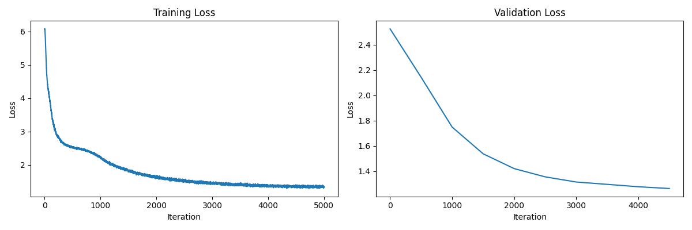

# KING RIZAW v0.1

A small language model trained on Shakespeare's works, generating text in a Shakespearean style with creative flair.

## Model Description

- **Model Type**: Transformer-based language model
- **Training Data**: Shakespeare's works
- **Model Size**: ~160K parameters
- **Use Cases**: Creative text generation, Shakespeare-style text continuations
- **Language**: English

## Usage

```python
# Example code to use the model
import torch
from transformers import AutoTokenizer, AutoModelForCausalLM

model_name = "Antonioguerra/KING_RIZAW_V0.1"
tokenizer = AutoTokenizer.from_pretrained(model_name)
model = AutoModelForCausalLM.from_pretrained(model_name)

prompt = "To be or not to be,"
inputs = tokenizer(prompt, return_tensors="pt")
outputs = model.generate(inputs["input_ids"], max_length=50, temperature=0.8)
result = tokenizer.decode(outputs[0], skip_special_tokens=True)
print(result)
```

## Training

This model was trained on a collection of Shakespeare's works using a transformer architecture with self-attention mechanisms. The training process utilized both standard training approaches and enhanced techniques to improve the quality of generated text.



## Parameters

- **Temperature**: Controls creativity - higher values produce more varied outputs
- **Max Tokens**: Maximum length of generated text (1 token ≈ 4 characters)

## License

This model is released under an open license for research and creative purposes.

## Author

- Antonio Guerra